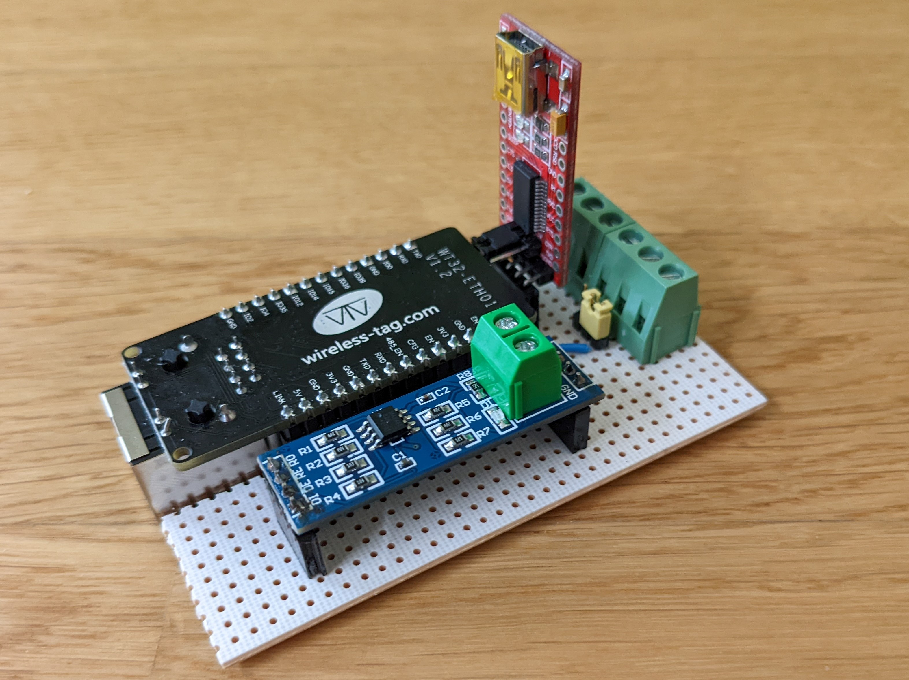
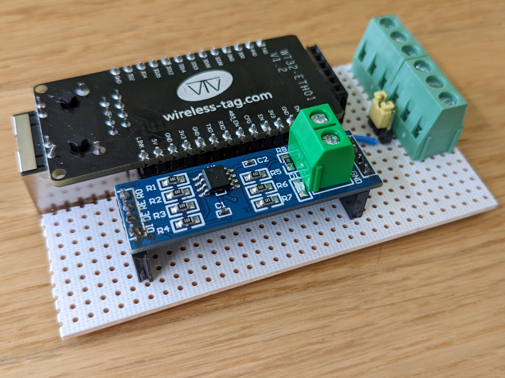
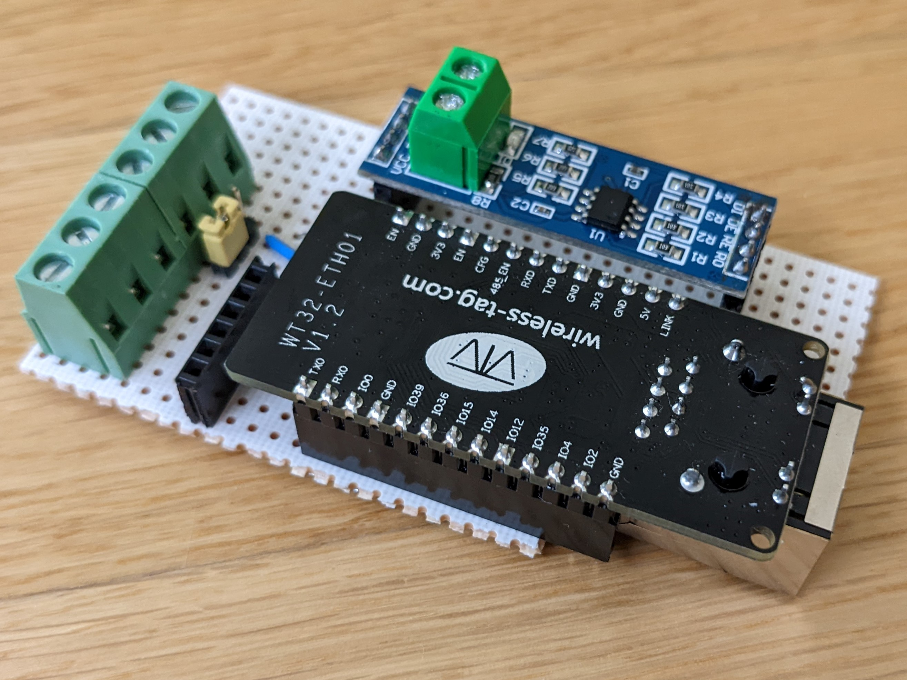

# Power Reader (LEO)

## Description

LEO (ließt Energie optimal) can be used to read SDM power meters via Modbus and a single power meter via SML protocol (optical).
The reporting of the measured values will be done wie MQTT (WiFi or Ethernet) 

## Getting Started

### Dependencies

* [ESPhome](https://esphome.io/): Used for config and flashing

### Wire connections

On one side there is a singe ethernet port. This can be used to connect to Ethernet (if configured)
The other side has three pairs of connectors:
- input voltage (5V | GND)
- optical sensor (+ | -)
- ModBus (A | B)

### Flashing

For flashing a ``YP-05 flasher`` is used. Check the picture how to connect it.
- The Jumper of the flasher must be set to 5V
- The Jumper on the PCB must be next to the blue wire on the PCB

## Pictures

## Version History

* 1.0
    * Initial Release
